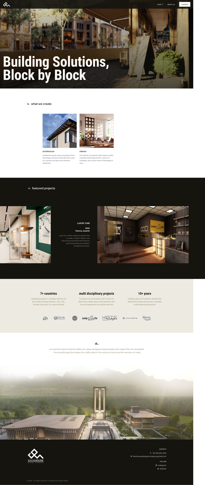

# blockHouse Design Company Website

Portfolio website for blockHouse Design Company, a multidisciplinary
architecture and interior design studio. Built with React and powered by
Sanity CMS so the studio can update projects and content without code.

🔗 **Live site:** https://www.blockhousedesigncompany.com

## About
blockHouse Design Company designs architecture and interior spaces for
residential, commercial and hospitality clients, with 320+ projects across
7+ countries and over a decade of practice. The site showcases the studio's
work and philosophy and gives potential clients an easy way to get in touch.

## Features
- Hero section with the studio tagline and full-width imagery
- "What we create" section covering architecture and interior design
- Featured projects carousel with project name, year, location and description
- Studio highlights: countries served, project count, years of practice
- Client logo strip
- Project work and about pages
- Contact details and social links (Instagram, LinkedIn)
- Content managed in Sanity Studio (projects, images, descriptions)
- Responsive layout for mobile, tablet and desktop

## Tech Stack
- **Frontend:** React [+ Vite / Next.js / Tailwind / animation library]
- **CMS:** Sanity (headless CMS and Sanity Studio)
- **Hosting:** Vercel
- **Domain:** blockhousedesigncompany.com

## My Role
[Design / frontend development / Sanity schema setup / deployment]
